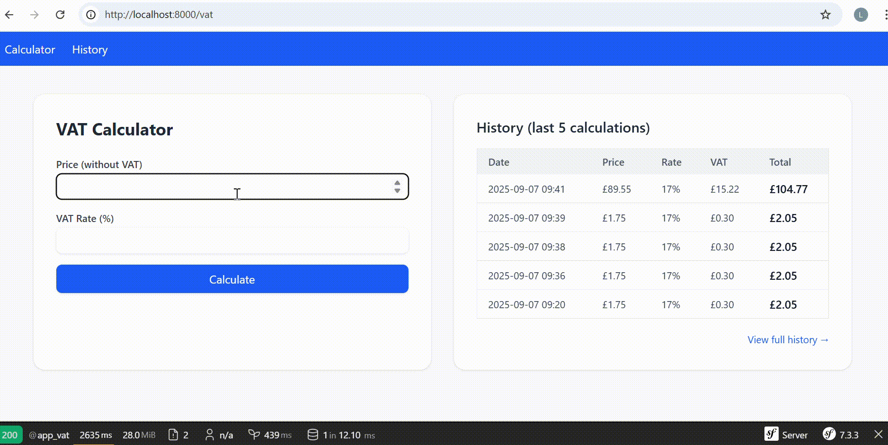

# VAT Calculator Web App

Simple Symfony app to calculate VAT and display formatted prices.

## Requirements

- PHP 8.1+
- Composer
- Git

## Setup & Run

```bash
# Clone the repository
git clone https://github.com/your-username/vat-calculator.git
cd vat-calculator

# Install all dependencies
composer install

# Use example environment file (SQLite DB)
cp .env-example .env.local

# Create database and run migrations
php bin/console doctrine:database:create
php bin/console doctrine:migrations:migrate

# Start the Symfony server
symfony server:start

## Demo


